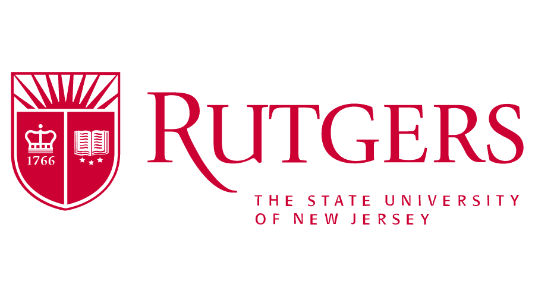
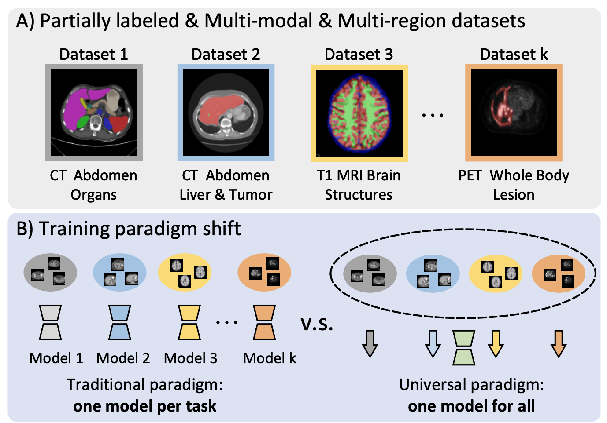
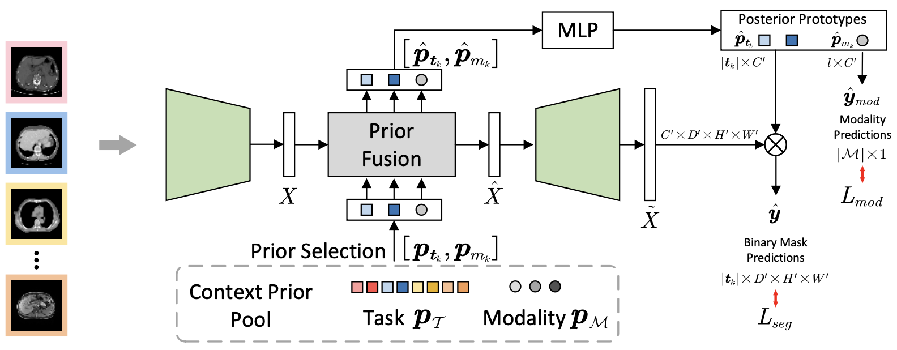

# Universal Medical Image Segmentation [](https://arxiv.org/pdf/2306.02416.pdf) [](https://yunhegao.tech/Hermes-page/)

<div align="center">
    <a></a>
    <a></a>

</div>


This repository if the official implementation for the paper:
> **[Training Like a Medical Resident: Context-Prior Learning Toward Universal Medical Image Segmentation](https://arxiv.org/abs/2306.02416)** \
> Yunhe Gao<sup>1</sup>, Zhuowei Li<sup>1</sup>, Di Liu <sup>1</sup>, Mu Zhou<sup>1</sup>, Shaoting Zhang<sup>2</sup>, Dimitris N. Metaxas <sup>1</sup> \
> <sup>1</sup> Rutgers University   <sup>2</sup> Shanghai Artificial Intelligence Laboratory



## Abstract

A major focus of clinical imaging workflow is disease diagnosis and management, leading to medical imaging datasets strongly tied to specific clinical objectives. This scenario has led to the prevailing practice of developing task-specific segmentation models, without gaining insights from widespread imaging cohorts. Inspired by the training program of medical radiology residents, we propose a shift towards universal medical image segmentation, a paradigm aiming to build medical image understanding foundation models by leveraging the diversity and commonality across clinical targets, body regions, and imaging modalities. Towards this goal, we develop *Hermes*, a novel context-prior learning approach to address the challenges of data heterogeneity and annotation differences in medical image segmentation. In a large collection of eleven diverse datasets (2,438 3D images) across five modalities (CT, PET, T1, T2 and cine MRI) and multiple body regions, we demonstrate the merit of the universal paradigm over the traditional paradigm on addressing multiple tasks within a single model. By exploiting the synergy across tasks, Hermes achieves state-of-the-art performance on all testing datasets and shows superior model scalability. Results on two additional datasets reveals Hermes' strong performance for transfer learning, incremental learning, and generalization to downstream tasks. Hermes's learned priors demonstrate an appealing trait to reflect the intricate relations among tasks and modalities, which aligns with the established anatomical and imaging principles in radiology. 


## Updates
* 06/10/2024 Code and Hermes-R model weights released.
* 02/27/2024 Accepted by CVPR 2024!
* 06/04/2023: [Hermes](https://arxiv.org/abs/2306.02416) paper uploaded to arXiv


## Usage

### Install Environment

First install required python packages: `pip install -r requirements.txt`

Then install [apex](https://github.com/NVIDIA/apex). Please install it according to the official guideline with the CUDA and C++ extensions. If the you can install apex with the official guideline, then you can ignore the following.

The installation of apex is kind of difficult where some errors may happen. This [comment](https://github.com/NVIDIA/apex/issues/1653#issuecomment-1537034300) is helpful for me. As we only use the fused_lamb optimizer in apex, we can adjust the apex install options like: `pip install -v --disable-pip-version-check --no-cache-dir --global-option="--cpp_ext" --global-option="--cuda_ext" --global-option="--deprecated_fused_lamb" ./`

If you have this issue: `ModuleNotFoundError: No module named 'torch._six'`, this [comment](https://github.com/NVIDIA/apex/issues/1724#issuecomment-1955962174) can help.

### Data Preprocess

Please download the original datasets from their official website.

In the `dataset_conversion` folder, I provide the preprocessing code for each dataset used in the paper. The preprocessing code basically reads the original images, and resamples the images into a uniform spacing of $1.5  mm\times 1.5 mm \times 1.5 mm$. 

For most datasets, please edit the `src_path` and `tgt_path` to be the downloaded dataset path, and the target path to store the processed dataset. Then you can run the preprocessing code by python. Take the BCV dataset for example, `python bcv_3d.py`, it will generate a `dataset.yaml` file, containing the name of all samples, under `list` folder in the `tgt_path`. The resampled images and corresponding label masks will also be saved in the `tgt_path`.  For dataset CHAOS, we need to first conver the dicom files into nii files, see in `chaos_t1dcm2nii.py` and `chaos_t2dcm2nii.py`, and then do the same spacing resample with `chaos_3d.py`.

After obtaining the resampled 3D images in the nii.gz format of all datasets, we perform a normalization on the image intensity with a z-score normalization. Besides, we convert the images into .npy file for later training. Please edit the `src_path` and `tgt_path` in the `nii2npy.py`, and then `python nii2npy.py`. The final folder structure for training set should be:

> npy
> > amos_ct
> + list
> + img_1.npy
> + img_1_gt.npy
> + ...
> > amos_mr
> + list
> + img_1.npy
> + img_1_gt.npy
> + ...
> > bcv
> + ...
> > ...

### Training
The trianing configurations are under `config/universal`. The dataset related configurations are under `training/dataset/dim3/`.

To train Hermes: `python train.py --batch_size 16 --gpu 0,1,2,3,4,5,6,7`

### Model Weights

The model weights for Hermes-R can be downloaded from [Google Drive](https://drive.google.com/file/d/1s3Rc5zpgNz9FA2eqKBExaXQ_nsbAPMT8/view?usp=sharing) or [Baidu Pan](https://pan.baidu.com/s/1FDMRzE_8kvPUaPQXg6fkVQ?pwd=yjyh)
## To Do
* Release Hermes-M model weights.

## Citation

If you use Hermes in your research, please cite our paper:

```bibtex
@article{gao2023training,
  title={Training Like a Medical Resident: Universal Medical Image Segmentation via Context Prior Learning},
  author={Gao, Yunhe and Li, Zhuowei and Liu, Di and Zhou, Mu and Zhang, Shaoting and Meta, Dimitris N},
  journal={arXiv preprint arXiv:2306.02416},
  year={2023}
}
```

## Contact

For questions and suggestions, please post a GitHub issue or contact us directly via email (yunhe.gao@rutgers.edu).

